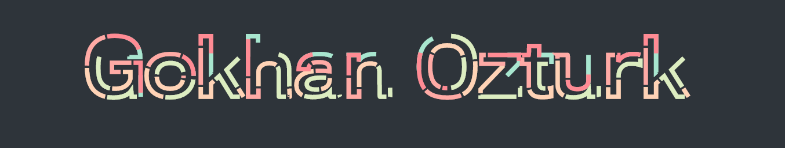
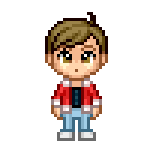

# Hi, I'm Gokhan 👋🏻 👨‍💻



&nbsp;

I'm a frontend developer with 4+ years of experience designing, developing, and managing responsive websites and internal frameworks. Passionate about using usability methods and creative designs Some technologies I enjoy working with include SCSS,LESS, JS, JQuery, ReactJS and VueJS 💖


## Find me around the web 🌎: <a href="https://github.com/gokhanozt"></a>
- Trying to have fun on <a href="http://www.gokhan.fun">gokhan.fun</a> (under construction) 🎮 ✍🏻
- You can find me on <a href="https://www.linkedin.com/in/ozturkgokhan94/">LinkedIn</a> 💼 🎓


<div align="left">

##### Fun fact: I once solved one of the world's oldest question with a single line of JavaScript


```javascript
// Which came first: the chicken or the egg?
console.log(['🥚', '🐣', '🐥', '🐔'].sort());

//Result was:
>>> [ '🐔', '🐣', '🐥', '🥚' ]
```

</div>

&nbsp;

&nbsp;

### Languages and Tools:


<br />
<br />
